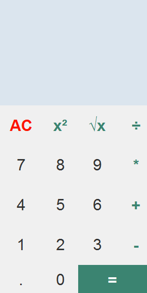
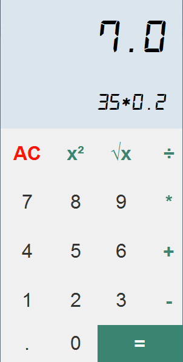

# _Calculator using Tkinter_

---

This is a simple calculator app built using `Python` and `Tkinter`. It has a nice looking GUI and good functionality. The calculator can also be used by keyboard as I have bound keys to it.

---
## Features

- Basic mathematical operations: 
  - Addition
  - Subtraction
  - Multiplication
  - Division
  - Square
  - Square Root
  

- Keyboard shortcuts for all operations

---

## How to Use

To use the calculator, simply enter your numbers and operations into the text field. You can also use the keyboard shortcuts to perform operations. The results will be displayed in the text field.
_Keyboard Shortcuts_

    + - Addition
    - - Subtraction
    * - Multiplication
    / - Division
    Esc - Clear

---

## Installation

There is no need to install the app. It is a standalone app. The standalone app is `dist/Calc.exe`.  So just open and it'll run.

Or if you want to run from the 
script, then

- Clone the repo
- Open the terminal or powershell from that folder
- Enter the following command:

    `python main.py`

## Screenshots

***Note: Kindly install Digital-7 Monoitalic font if not installed to get the font as in the second screenshot.***